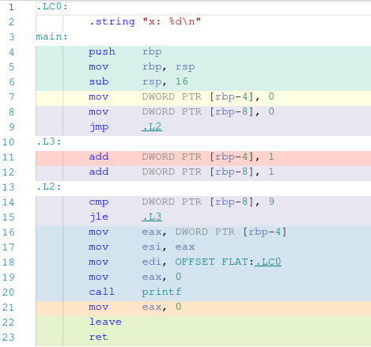
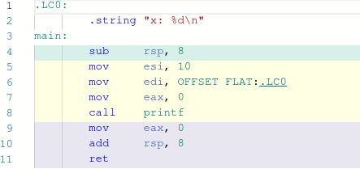
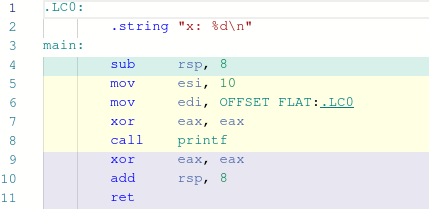

Considérer le programme simple `loops.c`:
```
#include <stdio.h>
#include <stdlib.h>

int main() {

    int x = 0;

    for (int i = 0; i < 10; i++) {
        x += 1;
    }

    printf("x: %d\n", x);

    return 0;
}
```

`gcc` est un outil très dynamique et quand on appelle `gcc -o loops loops.c` on déclenche une multitude des processus:
- traduire le fichier `.c` par le préprocessuer
- compiler le code source / faire des optimisations
- lier les fichiers d'objet `loops.o` et la bibliothèque standarde dans une éxécutable

Nous nous intéressons au sujet des optimisations au moment de la compilation du code source.
On spécifie le niveau d'optimisation avec l'option `-OX`, où `X` est le chiffre `0`, `1`, `2`, ou `3`.

## -O0
Par exemple, compiler notre programme `loops.c` avec la commande `gcc -o loops -O0 loops.c` désactive les optimisations automatiquement faites par `gcc`. Ca donne:


C'est pas très important de savoir lire le code en assemblée, le principe c'est de comprendre que le binôme `cmp` et `jle` aux lignes 14 et 15 est la traduction de notre condition `i < 10`. Si le variable dans un `DWORD PTR` (ce qui correspond a 4 octets, la taille d'un `int` sur l'architechture x86-64) n'est pas plus grand que 9, saute pour processer les instructions de `.L3`. L'instruction `jle` est la forme primitive d'un `goto`.

## -01
Maintenant, remarquons ce qui ce passe quand on compiler avec l'option `-O1`:


D'accord là on observe qu'il n'ya plus des instructions pour sauter, et en plus il n'y a qu'une seule fonction, `main`. Vous pouvez peut-être deviner que le compileur a déduit que le résultat de notre boucle est d'additioner 10 fois 1 à x. Donc, en ligne 5 on voit que la valeur 10 est stocké dans le registre `esi`, où elle va rester jusqu'à être affichée a l'écran par `printf`.
Une autre chose à souligner c'est le fait que a laissé tomber l'histoire des variables. C'est pas la peine de réserver 32 bits et stocker la valeur 0 à x. On va utiliser des valeurs plus rapidement accessible dans les registres du cpu au lieu d'aller chercher l'addresse d'une variable d'ailleurs.

## -O2 & -O3
Ici une optimisation dernière en commun avec les options `-O2` et `-O3`.


Essayer de réfléchir pourquoi l'instruction `xor` est une optimisation du code en assemblée d'avant